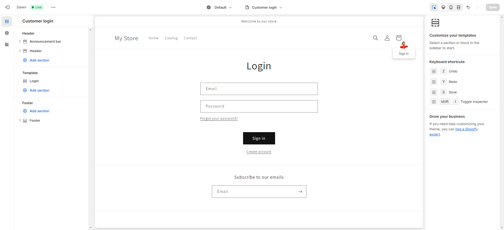
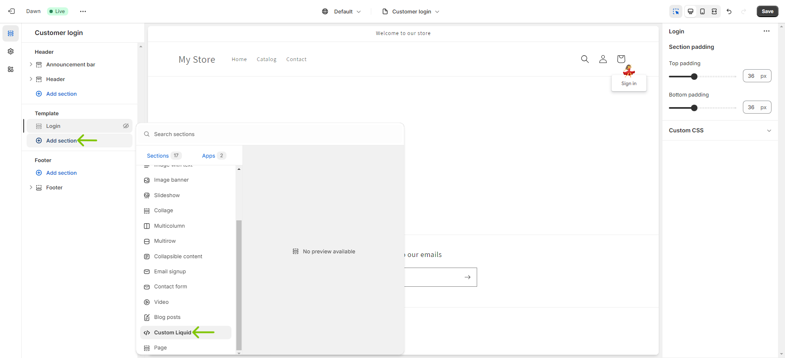
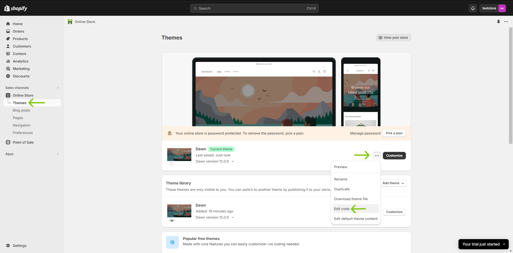

# OTPless Shopify Integration

### Step 1 : Install OTPless Shopify Plugin

- Visit [this link](https://apps.shopify.com/otpless-whatsapp-login) and install `OTPless Sign in` plugin.

    
    
    

### Step 2 : Sign in and Activate Plugin

- After installing, you will be redirected to the following page.
- Click on `Sign in to continue` and signin with your **work email-id**. (eg. for a domain `otpless.com` its recommended to signup using an email `something@otpless.com`)

    

- After successful Signin, you will be redirected to the OTPless plugin settings.

    

- Navigate to the `App Embeds` page, by clicking on the link in Step 1 in the plugin settings page,  **Turn On** `OTPless` and click `Save`.

    

<details close>
<summary><h2>OTPless Authentication Page</h2></summary>

### Thats it for OTPless login page integration

- In a new tab visit `{YOUR_STORE_DOMAIN}.com/account/' and you will be redirected to the OTPless login page.

    
    > NOTE: here the user will be redirected to an external page for authentication.
- To embed the **OTPless widget** in your existing login page(classic customer login or any custom page) follow the next steps.

</details>

<details close>
<summary><h2> OTPless Authentication Widget</h2></summary>

> Follow the steps below to add OTPless widget in your existing(classic) login page

### Step 3 : Deactivate default redirection

- Go to `OTPless plugin settings` page and expand the first question in the `Frequently Asked Questions` section and toggle the button on the right **OFF**. This deactivates the default redirection to OTPless authentication page.

    

### Step 4 : Add OTPless Widget to Login Page

- Navigate to `Online store>Themes` and click `Customize` on your current theme.

    

- From the Page Selection dropdown, navigate to `Classic customer accounts>Customer login` page.

    
    

- Hide the `Login` component from the Template section.

    
    

- Add OTPless Widget by clicking on `Add Section>Custom Liquid` and adding the following code to the `Liquid code` textbox.

    
    

- Thats it. Save the changes. and visit your account page `{YOUR_STORE_DOMAIN}.com/account/login` to see the OTPless widget embedded in your login page.

    > Classic LogIn Page with embeded `OTPless` login widget.
    

> Similarly, you can add OTPless widget in any page.

</details>

<details>
<summary><h2>Replace custom logins by themes or plugins</h2></summary>

- If your store has any other plugins for login, kindly remove them for OTPless integration.
- If your store has any other custom logins from your theme that is still not replaced by OTPless after following the steps above, follow the next steps to replace them with OTPless.

### Step 5 : Edit your theme

- Visit your store admin panel and navigate to `Online store>Themes`.
- Click on the `menu` icon of your current theme and select `Edit Code`.

    
- Open `themes.liquid` and scroll to the bottom of the file, between the `<script>` and `</script>` tags and add the following code (preferably before the `</script>`).
    ```js
    const accountBtn = document.querySelector("PASTE_THE_COPIED_SELECTOR_HERE");
    ```
    ```js
    accountBtn.onclick = () => {window.open("/account", _self);};
    ```
    
- Now, visit your store home page, and `right-click` on the `account` icon.
- `right-click` on the `<a>` tag and copy the selector.

    
    
- Paste the copied selector in the code above replacing the `PASTE_THE_COPIED_SELECTOR_HERE`.
- Save the changes and reload your store.

</details>

## Finally You can visit OTPless Dashboard for further configuration

- Visit [OTPless Dashboard](https://otpless.com/dashboard/app).

- Navigate to Settings for your app and customize your integration.
